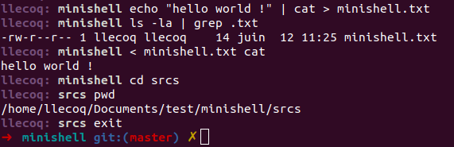

<p align="center">
  <a href="https://42lyon.fr/">
    
  </a>

  <h2 align="center">minishell</h2>

  <p align="center">
    This project is about creating a simple shell.
    <br>
    Yes, your own little bash.
    You will learn a lot about processes and file descriptors.
    <br>
    <br>
    /!\ SUBJECT LINKED IS MAY DIFFER FROM THE ONE USED FOR THIS PROGRAM /!\
    <br>
    <a href="./assets/en.subject.pdf">English Subject </a>
  </p>
</p>


## Table of contents

- [Quick start](#quick-start)
- [What's included](#whats-included)
- [Creators](#creators)


## Quick start

Compile :
```
make
```

run program :
```
./minishell
```

Minishell : just use it as your regular bash.




## What's included

```
minishell
├── Makefile
├── assets
│   ├── en.subject.pdf
│   └── final grade.png
├── includes
│   ├── builtin.h
│   ├── evaluator.h
│   ├── minishell.h
│   ├── prompt.h
│   └── utils.h
├── libft with printf and gnl
└── srcs
    ├── builtins
    │   ├── cd.c
    │   ├── echo.c
    │   ├── env.c
    │   ├── exit.c
    │   ├── export.c
    │   ├── pwd.c
    │   ├── unset.c
    │   └── utils
    │       ├── append_value_to_var.c
    │       ├── format_plus_equal_str.c
    │       ├── get_env.c
    │       ├── invalid_args_or_options.c
    │       ├── put_env.c
    │       ├── redir_single_builtin_cmd.c
    │       └── sort_list.c
    ├── execution
    │   ├── evaluator.c
    │   ├── process_input.c
    │   └── utils
    │       ├── ambiguous_redirect.c
    │       ├── build_file_path.c
    │       ├── create_pipe.c
    │       ├── create_redirection.c
    │       ├── dup_redirections.c
    │       ├── execute_child_process.c
    │       ├── execute_single_builtin.c
    │       ├── exit_status.c
    │       ├── path_is_unset.c
    │       └── search_expand_file_name.c
    ├── main.c
    ├── parsing
    │   ├── parser.c
    │   ├── tokenizer.c
    │   └── utils
    │       ├── parser_arg_list.c
    │       ├── parser_find_command.c
    │       ├── parser_flags.c
    │       ├── parser_heredoc.c
    │       ├── parser_split_semicolon.c
    │       ├── parser_store_commands_list.c
    │       ├── parser_trim_quotes.c
    │       ├── parser_utils.c
    │       ├── parser_variables.c
    │       ├── parser_variables_expansions.c
    │       ├── split_words_into_token.c
    │       ├── store_env_list.c
    │       ├── store_environment.c
    │       └── tokenizer_utils.c
    ├── prompt
    │   ├── prompt.c
    │   └── sig_handler.c
    └── utils
        ├── calloc_shell.c
        ├── char_detection.c
        ├── clear_memory.c
        ├── del.c
        ├── error.c
        ├── print_list.c
        ├── token_list_functions.c
        └── token_list_functions2.c
```

## Creators

PARSING : **abonnel**

- https://github.com/Anyaa6

ECUTION AND BUILTINS : **llecoq**

- <https://github.com/llecoq>
